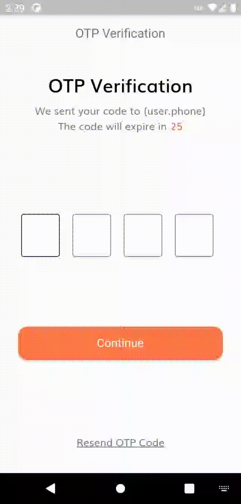

# Ecommerce Shop App

A complete ecommerce shopping app developed with flutter and firebase

> Note: the project is under development

## Demo

### Onboarding Screen

    
    

### Sign In

    
    
    

### Sign Up

    
    
    

## Features

- Onboarding screen
- Complete Authentication
- Google / Facebook / Twitter Signin
- Firebase as Backemd
- Responsive Design
- Getx State Management
- Clean architecture and Test driven approach

## Acknowledgements

- [App Design inspiration](https://github.com/abuanwar072/E-commerce-Complete-Flutter-UI/blob/master/intro.gif)